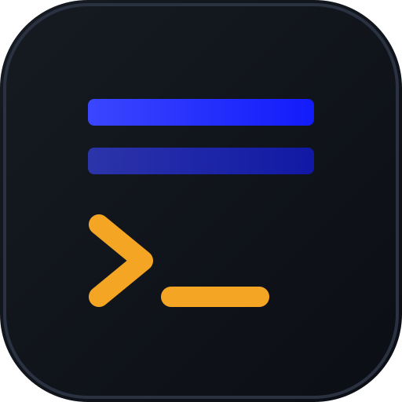
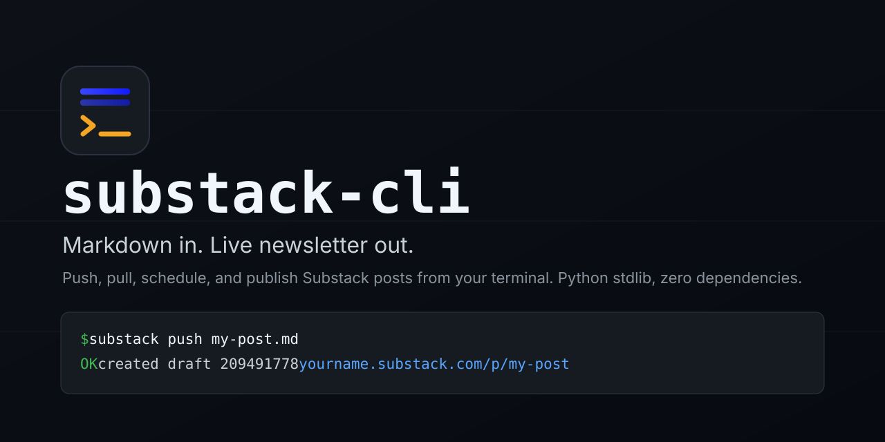
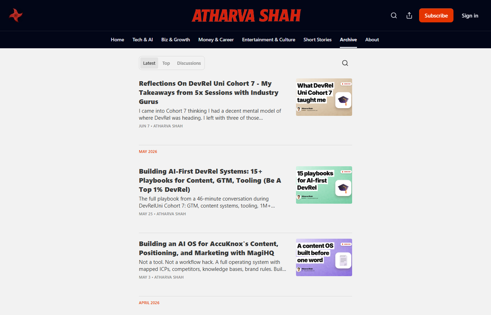
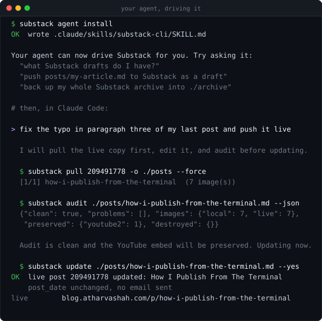
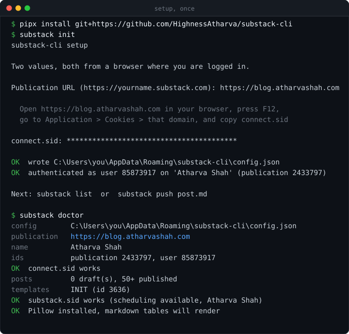
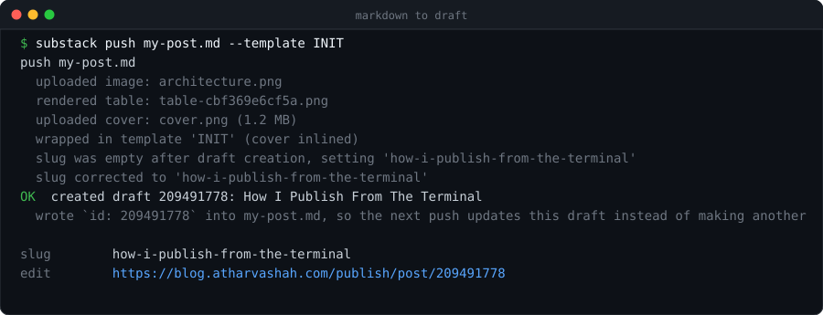
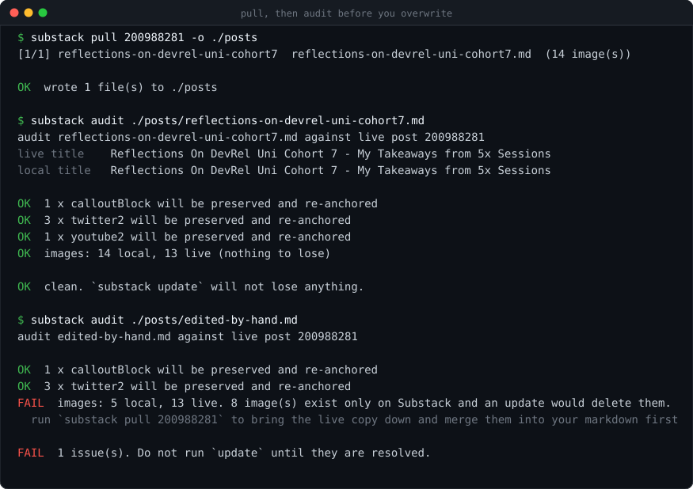
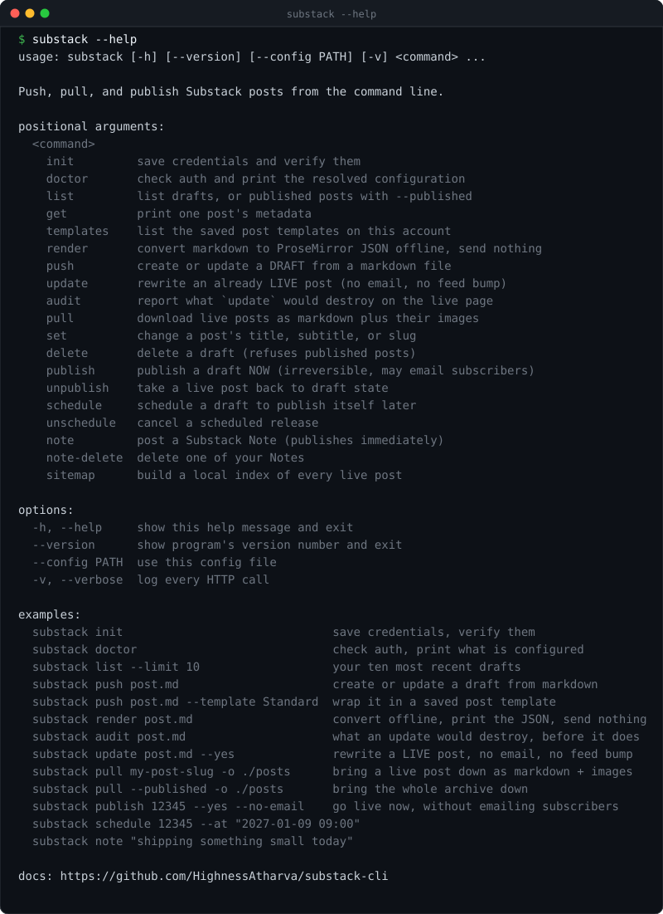

<div align="center">



# substack-cli

**Markdown in. Live newsletter out.**

A command line client for [Substack](https://substack.com), built so your coding agent can
run your newsletter for you. Push, pull, schedule, and publish without ever opening the
web editor.

[](LICENSE)
[](https://www.python.org/)
[](pyproject.toml)
[](docs/agents.md)
[](https://github.com/HighnessAtharva/substack-cli/actions)
[](https://github.com/HighnessAtharva/substack-cli/stargazers)

[Agents](#hand-it-to-your-agent) · [Install](#or-run-it-yourself) · [Commands](#every-command) · [Docs](docs/) · [Why](#substack-has-no-api-so-i-wrote-one)



</div>

---

## Substack has no API, so I wrote one

No public API, no official CLI, and no `git push` for a newsletter. Everything goes
through a web editor that owns your content, your formatting, and your workflow. You
cannot draft in your own editor, keep posts in version control, run a linter over them, or
script a publish.

The tools that do exist read Substack. They fetch feeds and scrape archives. Almost none
of them write, and the ones that try break the moment Cloudflare sees a `curl`
User-Agent.

This one writes. It has published 79 posts to a real newsletter since July 2024, and every
rule it enforces exists because something went wrong on a live page first.

<div align="center">
<a href="https://blog.atharvashah.com"></a>
<br>
<sub><a href="https://blog.atharvashah.com">blog.atharvashah.com</a> runs on this. Every post, cover, and schedule.</sub>
</div>

## Hand it to your agent

I did not build this to type commands. I built it so Claude Code could run my Substack
while I wrote. Three lines and yours can too.

```bash
pipx install git+https://github.com/HighnessAtharva/substack-cli
substack init            # you paste your publication URL and one cookie
substack agent install   # your agent learns the tool
```

Then talk to it in English:

```
"what Substack drafts do I have?"
"push posts/how-i-publish.md as a draft and give me the link"
"fix the typo in paragraph three of my last post and update it live"
"back up my whole Substack archive into ./archive and commit it"
"schedule Tuesday's draft for 9am, no email"
```



`agent install` writes the instruction file your agent already reads. It detects which one
you use, and it never clobbers rules you already have.

| Agent | File it writes |
|---|---|
| Claude Code, Claude Desktop | `.claude/skills/substack-cli/SKILL.md` |
| Cursor | `.cursor/rules/substack-cli.mdc` |
| Codex, Gemini CLI, Aider, Cline | `AGENTS.md` |

That file is the part that matters. It is not a command list, it is the operating
knowledge that stops an agent doing damage: seven hard rules, the two-bodies trap that
makes a push to a live post silently do nothing, the safe edit loop, the exit codes, and
six worked recipes. Read it with `substack agent print`, or in
[docs/agents.md](docs/agents.md).

Everything gates on one machine-readable check:

```bash
substack audit post.md --json    # {"clean": true, "destroyed": {}, ...}
```

`clean` is the whole decision. An agent that respects it cannot delete your work.

One caveat worth knowing before you ask for it. Scheduling a **post** is real and
server-side, and needs a second cookie saved once with `substack init --hub-token`.
Scheduling a **Note** is impossible, because Substack has no endpoint for it, so your
agent will offer to schedule the command instead: a one-off Claude Code routine, a `cron`
entry, or a Task Scheduler job that runs `substack note` at the moment you wanted.

## Or run it yourself

```bash
substack init
substack doctor
```



Setup needs two things: your publication URL, and the `connect.sid` cookie from a browser
where you are already logged in. That is the whole setup. The publication id and user id
are read off the API and cached for you. The walkthrough with exactly where the cookie
lives is in [docs/authentication.md](docs/authentication.md).

Write a post:

```markdown
---
title: How I Publish From The Terminal
subtitle: One command, no web editor
slug: how-i-publish-from-the-terminal
cover: cover.png
---

Your article body, in plain markdown.
```

Ship it:

```bash
substack push my-post.md
```



The draft id is written back into your frontmatter, so the next push updates that same
draft instead of creating a second one. When you are ready:

```bash
substack publish 209491778 --yes --no-email
```

## What it can do

| | |
|---|---|
| **Push** | A markdown file becomes a Substack draft. Headings, bold, links, code blocks, lists, quotes, images, and captions all convert. |
| **Pull** | A live post comes back down as markdown with every image downloaded next to it. |
| **Update** | Rewrite an already published post in place. No email, no feed bump, same URL. |
| **Audit** | Report exactly what an update would destroy, before it destroys it. |
| **Publish** | Go live now, with or without emailing subscribers. |
| **Schedule** | Set a real server-side scheduled release, and cancel it. |
| **Notes** | Post a Substack Note from a file or a string, with image attachments. |
| **Tables** | Markdown tables render to a PNG, because Substack's editor has no table support. |
| **Covers** | The hero image uploads itself and fills your template's cover slot. |
| **Slugs** | Your file owns the public URL. Substack never gets to invent a truncated one. |

It runs on the Python standard library alone. There are no dependencies to install, no API
key to request, no browser to automate, and no Node runtime anywhere. Pillow is the one
optional extra, and only if you want tables rendered.

## The command that stops you losing work

`update` regenerates a live post's body from your markdown. Anything on the page that your
markdown does not mention is gone, with no undo and nothing in the output warning you. On
my own publication that would have silently deleted 125 images, 24 captions, 9 embeds, 2
videos, and 2 pullquotes across 33 posts.

So `audit` runs first. It compares the live page against what your file would produce and
exits non-zero when an update would lose something.



Editor-only blocks that markdown cannot express (YouTube embeds, uploaded video, Twitter
embeds, callouts, pullquotes) are extracted from the live body and re-anchored after the
same paragraph they followed. Rewriting the text around them does not lose them.

## Every command



| Command | What it does |
|---|---|
| `substack init` | Save credentials and verify them. |
| `substack agent install` | Teach Claude Code, Cursor, or any agent to drive this. |
| `substack doctor` | Check auth and print the resolved configuration. |
| `substack list [--published]` | List drafts, or live posts. |
| `substack get <id\|slug>` | Print one post's metadata. |
| `substack push <file>` | Create or update a draft from markdown. |
| `substack update <file> --yes` | Rewrite a live post. No email, no feed bump. |
| `substack audit <file> [--json]` | Report what an update would destroy. |
| `substack pull <id\|slug>` | Download a live post as markdown plus images. |
| `substack pull --published` | Download the entire archive. |
| `substack render <file>` | Convert to ProseMirror JSON offline. Sends nothing. |
| `substack publish <id> --yes` | Publish now. `--no-email` puts it on the web quietly. |
| `substack unpublish <id> --yes` | Take a live post back to draft. |
| `substack schedule <id> --at "..."` | Real server-side scheduled release. |
| `substack unschedule <id>` | Cancel it. |
| `substack set <id> --title --subtitle --slug` | Change metadata in place. |
| `substack delete <id>` | Delete a draft. Refuses published posts. |
| `substack note "text"` | Post a Substack Note. |
| `substack note-delete <id>` | Delete one of your Notes. |
| `substack templates` | List the saved post templates on your account. |
| `substack sitemap` | Build a local index of every live post. |

Full reference with every flag: [docs/commands.md](docs/commands.md).

## What people do with it

**Let an agent run the whole pipeline.** Write the article, then ask your agent to convert
it, upload the images, audit the live page, and hand back a link. See
[docs/agents.md](docs/agents.md).

**Version control your newsletter.** Keep every post in a git repo, review changes in a
pull request, and push the merged file to Substack. Your archive stops living in someone
else's database.

**Back up everything.** `substack pull --published -o ./archive` writes every live post to
markdown with its images downloaded alongside. Run it on a cron and you own a real copy.

**Migrate in.** Point `push` at the markdown you already have in Hugo, Jekyll, Obsidian,
or Notion exports and move a whole blog across without touching the editor.

**Automate the pipeline.** Lint, spell-check, score, or run a model pass over a file in
CI, then push and schedule it. Every command is scriptable and exits non-zero on failure.

## Nothing destructive happens by accident

- `publish`, `update`, and `unpublish` all refuse to run without `--yes`, and each one
  prints what it is about to do first.
- `delete` refuses published posts outright and tells you to `unpublish` first.
- `update` prints its destroy list before it touches anything, and `audit` exits 1 when
  the local file is not a superset of the live page.
- `render` converts offline and sends nothing, so an agent can check its own work before
  any write reaches the network.
- Your cookies live in a `0600` config file or in environment variables, and nothing ever
  prints them back.

## Documentation

| | |
|---|---|
| [agents.md](docs/agents.md) | Let Claude Code, Cursor, or Codex run your Substack. |
| [installation.md](docs/installation.md) | Every install path, Windows included. |
| [authentication.md](docs/authentication.md) | Where the two cookies live and how long they last. |
| [commands.md](docs/commands.md) | Complete reference, every flag, every exit code. |
| [frontmatter.md](docs/frontmatter.md) | Every field the tool reads and writes. |
| [markdown.md](docs/markdown.md) | What converts, what does not, and why. |
| [workflows.md](docs/workflows.md) | Git-backed publishing, backups, migrations, CI. |
| [api-notes.md](docs/api-notes.md) | The undocumented Substack API, written down. |
| [troubleshooting.md](docs/troubleshooting.md) | Every error message and its fix. |
| [faq.md](docs/faq.md) | Is this allowed, will it break, what about paid posts. |

## Contributing

Issues and pull requests are welcome. The test suite is 110 offline checks that run in
under a second, and every one of them pins a bug that reached a live newsletter.

```bash
git clone https://github.com/HighnessAtharva/substack-cli
cd substack-cli
pip install -e ".[dev]"
pytest -q && ruff check .
```

Read [CONTRIBUTING.md](CONTRIBUTING.md) first.

## Who made this

**Atharva Shah**, who publishes at [blog.atharvashah.com](https://blog.atharvashah.com)
and uses this to do it.

[](https://atharvashah.com)
[](https://blog.atharvashah.com)
[](https://github.com/HighnessAtharva)
[](https://www.linkedin.com/in/atharva-shah-tech/)
[](https://x.com/cultist_dev)

If this saved you an afternoon, a star helps other writers find it.

## Legal

MIT licensed. Not affiliated with, endorsed by, or supported by Substack Inc. It drives
the same private endpoints your browser does, using your own session cookie, against your
own publication. Read [docs/faq.md](docs/faq.md) before you build a business on it.

---

<div align="center">
<sub>

**Keywords**: substack api · substack cli · publish to substack from markdown ·
substack markdown import · substack automation · substack python client ·
newsletter as code · substack backup · export substack posts · substack scheduler ·
claude code substack skill · agent publishing tools · AGENTS.md

</sub>
</div>
